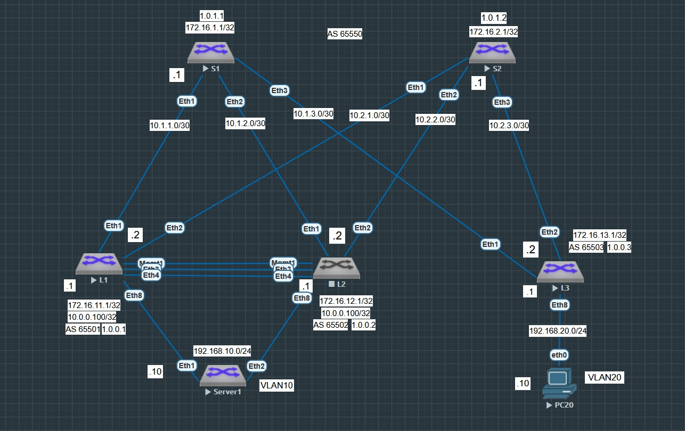
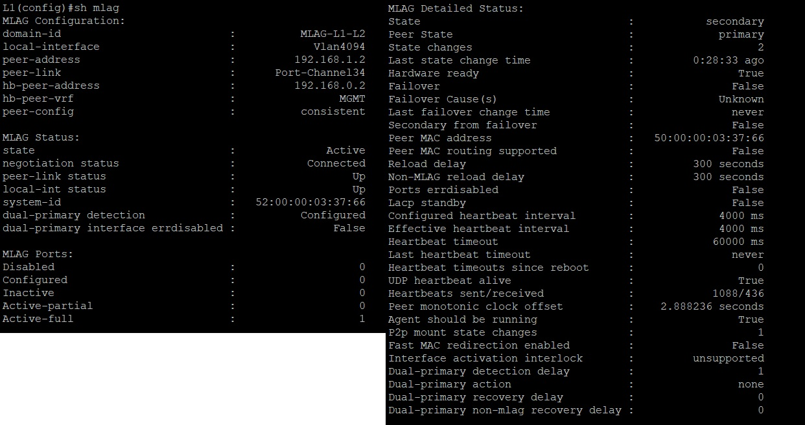
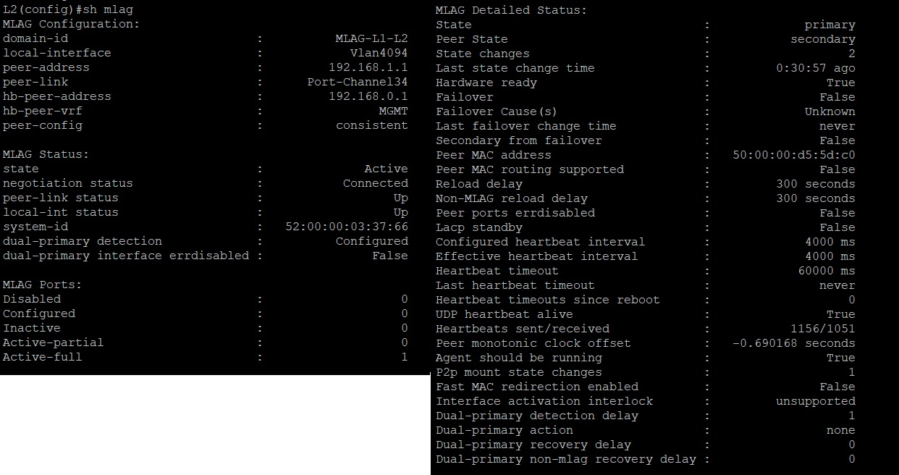
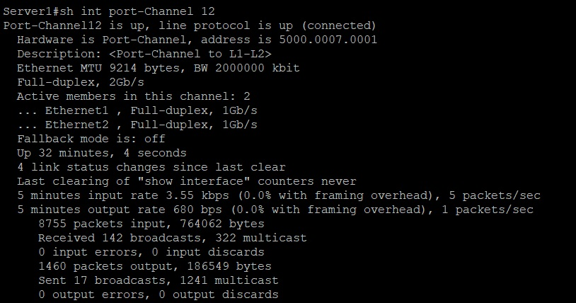
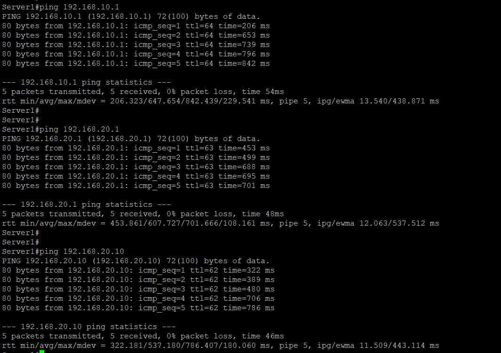
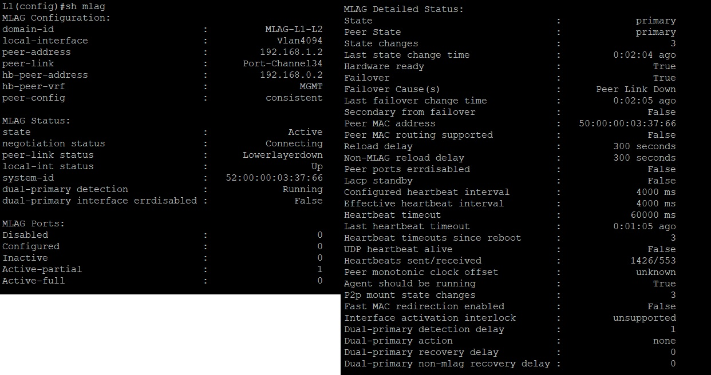
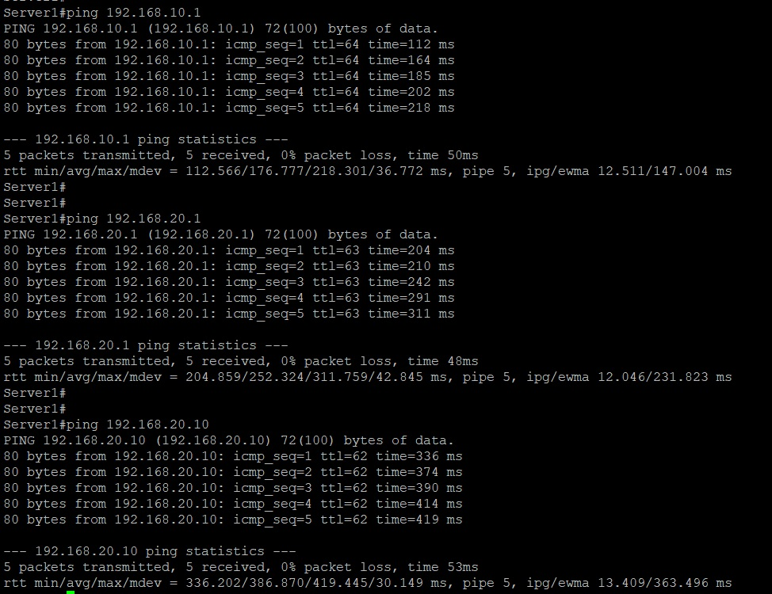

# Лабораторная работа №7. Multihoming EVPN

## Цель

Настроить отказоустойчивое подключение клиентов с использованием EVPN Multihoming.

## Постановка задачи


1. Подключить клиентов 2-я линками к различным Leaf
2. Настроить агрегированный канал со стороны клиента
3. Настроить multihoming для работы в Overlay сети. Если используете Cisco NXOS - vPC, если иной вендор - то ESI LAG (либо MC-LAG с поддержкой VXLAN)
4. Зафиксировать в документации план работы, адресное пространство, схему сети и конфигурацию устройств
5. Протестировать отказоустойчивость. Убедиться, что связнность не теряется при отключении одного из линков.


## Описание задачи

Настроить агрегированный канал от конечного устройства до двух коммутаторов Leaf.

# Введение

В качестве исходной сети, возьмем сеть из лабораторной работы №6 с уже настроенным Underlay и Overlay на основе eBGP. В качестве модели multihoming возьмем VXLAN MLAG между двумя
Leaf коммутаторами, соединив их PEERLINK и KEEPALIVE каналами. В качестве IRB оставим Симметричкную модель маршрутизации.

В результате добавления еще одного коммутатора в роли сервреного устройства стали наблюдаться проблемы с производительностью в лабораторном стенде. Появились потери пакетов на
линиях связи. Для снижения нашрузки на стенд было принято решение исключить использование протокола BFD. После отключения протокола производительность стенда поднялась до
приемлемого уровня.

## Термины

- EVPN (Ethernet VPN) - технология для создания масштабируемых и гибких VPN, которая использует BGP для управления и VXLAN для инкапсуляции трафика, объединяя уровень 2 и 
уровень 3 в единую архитектуру
- IRB (Integrated Routing and Bridging) - cетевая технология, которая объединяет функции мостового соединения уровня 2 и маршрутизации уровня 3 в одном устройстве для соединения
различных сетевых сегментов или VLAN.
- MLAG - технология, объединяющая два физических коммутатора в один логический для создания отказоустойчивых сетей.
- PEERLINK - канал синхронизации устройств, включенных в обмен MLAG
- KEEPALIVE - канал отследивания доступности устройств

## Оборудование

1. Виртуальный коммутатор окружения Eve-NG на базе операционной системы vEOS версии EOS-4.29.2F
2. Виртуальный хост окружения Eve-NG

## Именование и термины

В качестве исходной сети была использована ранее спроектированная лабораторная сеть из Лаборатоной роботы №4. Все сетевые устройства имеют свои уникальные имена, отражающие их
функциональное назначение:

- S1 - Spine коммутатор №1
- S2 - Spine коммутатор №2

- L1 - Leaf коммутатор №1
- L2 - Leaf коммутатор №2
- L3 - Leaf коммутатор №3

- Server1 - Маршрутизатор имитирующий роль сервера, подключенный к Leaf коммутаторам №1 и №2. Принадлежит VLAN10.
- PC20 - Виртуальный хост, подкчобенный к Leaf коммутатору №3. Принадледит VLAN20.

### Таблица адресов сетевых устройств Spine

|N|Device|Port|IP Address|Prefix|
|:-:|:-:|:-:|:-:|:-:|
|1|S1|eth1|10.1.1.1|30|
|2|S1|eth2|10.1.2.1|30|
|3|S1|eth3|10.1.3.1|30|
|4|S2|eth1|10.2.1.1|30|
|5|S2|eth2|10.2.2.1|30|
|6|S2|eth3|10.2.3.1|30|

### Таблица адресов сетевых устройств Leaf

|N|Device|Port|IP Address|Prefix|
|:-:|:-:|:-:|:-:|:-:|
|1|L1|eth1|10.1.1.2|30|
|2|L1|eth2|10.2.1.2|30|
|3|L2|eth1|10.1.2.2|30|
|4|L2|eth2|10.2.2.2|30|
|5|L3|eth1|10.1.3.2|30|
|6|L3|eth2|10.2.3.2|30|

### Таблица Loopback адресов сетевых устройств

|N|Device|Port|IP Address|Prefix|
|:-:|:-:|:-:|:-:|:-:|
|1|S1|Lo0|172.16.1.1|32|
|2|S2|Lo0|172.16.2.1|32|
|3|L1|Lo0|172.16.11.1|32|
|4|L2|Lo0|172.16.12.1|32|
|5|L3|Lo0|172.16.13.1|32|

### Таблица адресов конечных устройств

|N|Device|Port|IP Address|Prefix|Default Gateway|
|:-:|:-:|:-:|:-:|:-:|:-:|
|1|Server1|eth1|192.168.10.10|24|192.168.10.1|
|2|PC20|eth0|192.168.20.10|24|192.168.20.1|


### Таблица принадлежности конечных устройств соответствующим VLAN

|N|Device|VLAN ID|
|:-:|:-:|:-:|
|1|Server1|VLAN 10|
|2|PC20|VLAN 20|

### Таблица MLAG адресов сетевых устройств

|N|Device|Link Type|IP Address|Prefix|
|:-:|:-:|:-:|:-:|:-:|
|1|L1|peerlink|192.168.1.1|30|
|2|L2|peerlink|192.168.1.2|30|
|3|L1|keepalive|192.168.0.1|30|
|4|L1|keepalive|192.168.0.2|30|

## Описание стенда

В рамках лабораторной работы на предоставленном учебным центром лабораторном окружении было использовано пять коммутаторов. Данные коммутаторы были соеденины линиями связи по
схеме CLOS, два из которых (S1 и S2) выступают в качестве Spine устройств, и три (L1,L2 и L3) в качестве Leaf устройств. Устройства MLAG (L1 и L2) объединим каналами связи
PEERLINK и KEEPALIVE. Схема сети в рамках лабораторного окружения представлена на рисунке ниже:



## Настройка устройств

В рамках учебной лабораторной среды на всех сетевых устройствах был настроен протокол EVPN VXLAN поверх Underlay сети с импользованием eBGP протокола. Так как в качестве UNDERLAY
сети мы взяли протокол eBGP, все Spine устройства находятся в одной автономной системе (AS65550), в то время как каждое устройство Leaf находится в своей автономной системе 
(AS65501-AS65549). Устройство Server1 объединим с L1 и L2 посредством агрегации наналов связи LACP.

Ниже приведены частичные настройки файлов конфигураций сетевых устройств:

#### Spine устройства

**S1**

```
service routing protocols model multi-agent
!
hostname S1
!
interface Ethernet1
   description <leaf L1>
   mtu 9214
   no switchport
   ip address 10.1.1.1/30
!
interface Ethernet2
   description <leaf L2>
   mtu 9214
   no switchport
   ip address 10.1.2.1/30
!
interface Ethernet3
   description <leaf L3>
   mtu 9214
   no switchport
   ip address 10.1.3.1/30
!
interface Loopback0
   ip address 172.16.1.1/32
!
ip routing
!
peer-filter LEAFS_ASN
   10 match as-range 65501-65503 result accept
!
router bgp 65550
   router-id 1.0.1.1
   no bgp default ipv4-unicast
   timers bgp 1 3
   distance bgp 20 200 200
   maximum-paths 2 ecmp 2
   bgp listen range 172.16.0.0/16 peer-group EVPN peer-filter LEAFS_ASN
   bgp listen range 10.0.0.0/8 peer-group LEAF peer-filter LEAFS_ASN
   neighbor EVPN peer group
   neighbor EVPN update-source Loopback0
   neighbor EVPN ebgp-multihop 3
   neighbor EVPN send-community extended
   neighbor LEAF peer group
   neighbor LEAF out-delay 0
   neighbor LEAF bfd
   neighbor LEAF password 7 CFF54tD4K3HqNxXFU7fUvg==
   !
   address-family evpn
      neighbor EVPN activate
   !
   address-family ipv4
      neighbor LEAF activate
      network 172.16.1.1/32
!
end
```

**S2**

```
service routing protocols model multi-agent
!
hostname S2
!
interface Ethernet1
   description <leaf L1>
   mtu 9214
   no switchport
   ip address 10.2.1.1/30
!
interface Ethernet2
   description <leaf L2>
   mtu 9214
   no switchport
   ip address 10.2.2.1/30
!
interface Ethernet3
   description <leaf L3>
   mtu 9214
   no switchport
   ip address 10.2.3.1/30
!
interface Loopback0
   ip address 172.16.2.1/32
!
ip routing
!
peer-filter LEAFS_ASN
   10 match as-range 65501-65503 result accept
!
router bgp 65550
   router-id 1.0.1.2
   no bgp default ipv4-unicast
   timers bgp 1 3
   distance bgp 20 200 200
   maximum-paths 2 ecmp 2
   bgp listen range 172.16.0.0/16 peer-group EVPN peer-filter LEAFS_ASN
   bgp listen range 10.0.0.0/8 peer-group LEAF peer-filter LEAFS_ASN
   neighbor EVPN peer group
   neighbor EVPN update-source Loopback0
   neighbor EVPN ebgp-multihop 3
   neighbor EVPN send-community extended
   neighbor LEAF peer group
   neighbor LEAF out-delay 0
   neighbor LEAF bfd
   neighbor LEAF password 7 CFF54tD4K3HqNxXFU7fUvg==
   !
   address-family evpn
      neighbor EVPN activate
   !
   address-family ipv4
      neighbor LEAF activate
      network 172.16.2.1/32
!
end
```

#### Leaf устройства

**L1**

```
service routing protocols model multi-agent
!
no logging console
no logging monitor
!
hostname L1
!
spanning-tree mode mstp
no spanning-tree vlan-id 4094
!
vlan 10
   name VLAN10
!
vlan 4094
   name MLAG_PEERLINK
!
vrf instance MGMT
!
vrf instance VRF1
!
interface Port-Channel8
   description <Port-Channel to Server1>
   switchport mode trunk
   mlag 1
!
interface Port-Channel34
   description <MLAG PEERLINK>
   switchport trunk allowed vlan 4094
   switchport mode trunk
   spanning-tree link-type point-to-point
!
interface Ethernet1
   description <spine S1>
   mtu 9214
   no switchport
   ip address 10.1.1.2/30
!
interface Ethernet2
   description <spine S2>
   mtu 9214
   no switchport
   ip address 10.2.1.2/30
!
interface Ethernet3
   description <MLAG PEERLINK>
   channel-group 34 mode active
!
interface Ethernet4
   description <MLAG PEERLINK>
   channel-group 34 mode active
!
interface Ethernet8
   description <Link to Server1>
   mtu 9214
   channel-group 8 mode active
!
interface Loopback0
   ip address 172.16.11.1/32
!
interface Loopback1
   description <VXLAN VTEP>
   ip address 10.0.0.100/32
!
interface Management1
   description <MLAG KEEPALIVE>
   vrf MGMT
   ip address 192.168.0.1/30
!
interface Vlan10
   description <User`s VLAN10>
   vrf VRF1
   ip address 192.168.10.100/24
   ip virtual-router address 192.168.10.1
!
interface Vlan4094
   description <MLAG PEERLINK VLAN>
   no autostate
   ip address 192.168.1.1/30
!
interface Vxlan1
   vxlan source-interface Loopback1
   vxlan udp-port 4789
   vxlan vlan 10 vni 10010
   vxlan vrf VRF1 vni 111111
   vxlan learn-restrict any
!
ip virtual-router mac-address aa:11:00:00:00:00
!
ip routing
ip routing vrf MGMT
ip routing vrf VRF1
!
mlag configuration
   domain-id MLAG-L1-L2
   local-interface Vlan4094
   peer-address 192.168.1.2
   peer-address heartbeat 192.168.0.2 vrf MGMT
   peer-link Port-Channel34
   dual-primary detection delay 1
!
router bgp 65501
   router-id 1.0.0.1
   no bgp default ipv4-unicast
   timers bgp 1 3
   distance bgp 20 200 200
   maximum-paths 2 ecmp 2
   neighbor EVPN peer group
   neighbor EVPN remote-as 65550
   neighbor EVPN update-source Loopback0
   neighbor EVPN ebgp-multihop 3
   neighbor EVPN send-community extended
   neighbor MLAG peer group
   neighbor MLAG remote-as 65502
   neighbor MLAG next-hop-self
   neighbor SPINE peer group
   neighbor SPINE remote-as 65550
   neighbor SPINE out-delay 0
   neighbor SPINE password 7 TELv/X/TsJAOPeWXSZ/FGA==
   neighbor 10.1.1.1 peer group SPINE
   neighbor 10.2.1.1 peer group SPINE
   neighbor 172.16.1.1 peer group EVPN
   neighbor 172.16.2.1 peer group EVPN
   neighbor 192.168.1.2 peer group MLAG
   !
   vlan 10
      rd auto
      route-target both 10:10010
      redistribute learned
   !
   address-family evpn
      neighbor EVPN activate
   !
   address-family ipv4
      neighbor SPINE activate
      network 10.0.0.100/32
      network 172.16.11.1/32
   !
   vrf VRF1
      rd 65501:1
      route-target import evpn 1:111111
      route-target export evpn 1:111111
      redistribute connected
!
end
```

**L2**

```
service routing protocols model multi-agent
!
no logging console
no logging monitor
!
hostname L2
!
spanning-tree mode mstp
no spanning-tree vlan-id 4094
!
vlan 10
   name VLAN10
!
vlan 4094
   name MLAG_PEERLINK
!
vrf instance MGMT
!
vrf instance VRF1
!
interface Port-Channel8
   description <Port-Channel to Server1>
   switchport mode trunk
   mlag 1
!
interface Port-Channel34
   description <MLAG PEERLINK>
   switchport trunk allowed vlan 4094
   switchport mode trunk
   spanning-tree link-type point-to-point
!
interface Ethernet1
   description <spine S1>
   mtu 9214
   no switchport
   ip address 10.1.2.2/30
!
interface Ethernet2
   description <spine S2>
   mtu 9214
   no switchport
   ip address 10.2.2.2/30
!
interface Ethernet3
   description <MLAG PEERLINK>
   channel-group 34 mode active
!
interface Ethernet4
   description <MLAG PEERLINK>
   channel-group 34 mode active
!
interface Ethernet8
   description <Link to Server1>
   mtu 9214
   channel-group 8 mode active
!
interface Loopback0
   ip address 172.16.12.1/32
!
interface Loopback1
   description <VXLAN VTEP>
   ip address 10.0.0.100/32
!
interface Management1
   description <MLAG KEEPALIVE>
   vrf MGMT
   ip address 192.168.0.1/30
!
interface Vlan10
   description <User`s VLAN10>
   vrf VRF1
   ip address 192.168.10.200/24
   ip virtual-router address 192.168.10.1
!
interface Vlan4094
   description <MLAG PEERLINK VLAN>
   no autostate
   ip address 192.168.1.2/30
!
interface Vxlan1
   vxlan source-interface Loopback1
   vxlan udp-port 4789
   vxlan vlan 10 vni 10010
   vxlan vrf VRF1 vni 111111
   vxlan learn-restrict any
!
ip virtual-router mac-address aa:11:00:00:00:00
!
ip routing
ip routing vrf MGMT
ip routing vrf VRF1
!
mlag configuration
   domain-id MLAG-L1-L2
   local-interface Vlan4094
   peer-address 192.168.1.1
   peer-address heartbeat 192.168.0.1 vrf MGMT
   peer-link Port-Channel34
   dual-primary detection delay 1
!
router bgp 65502
   router-id 1.0.0.2
   no bgp default ipv4-unicast
   timers bgp 1 3
   distance bgp 20 200 200
   maximum-paths 2 ecmp 2
   neighbor EVPN peer group
   neighbor EVPN remote-as 65550
   neighbor EVPN update-source Loopback0
   neighbor EVPN ebgp-multihop 3
   neighbor EVPN send-community extended
   neighbor MLAG peer group
   neighbor MLAG remote-as 65501
   neighbor MLAG next-hop-self
   neighbor SPINE peer group
   neighbor SPINE remote-as 65550
   neighbor SPINE out-delay 0
   neighbor SPINE password 7 TELv/X/TsJAOPeWXSZ/FGA==
   neighbor 10.1.2.1 peer group SPINE
   neighbor 10.2.2.1 peer group SPINE
   neighbor 172.16.1.1 peer group EVPN
   neighbor 172.16.2.1 peer group EVPN
   neighbor 192.168.1.1 peer group MLAG
   !
   vlan 10
      rd auto
      route-target both 10:10010
      redistribute learned
   !
   address-family evpn
      neighbor EVPN activate
   !
   address-family ipv4
      neighbor SPINE activate
      network 10.0.0.100/32
      network 172.16.12.1/32
   !
   vrf VRF1
      rd 65502:1
      route-target import evpn 1:111111
      route-target export evpn 1:111111
      redistribute connected
!
end
```

**L3**

```
service routing protocols model multi-agent
!
no logging console
no logging monitor
!
hostname L3
!
spanning-tree mode mstp
!
vlan 20
   name VLAN20
!
vrf instance VRF1
!
interface Ethernet1
   description <spine S1>
   mtu 9214
   no switchport
   ip address 10.1.3.2/30
!
interface Ethernet2
   description <spine S2>
   mtu 9214
   no switchport
   ip address 10.2.3.2/30
!
interface Ethernet8
   description <PC20>
   mtu 9214
   switchport access vlan 20
!
interface Loopback0
   ip address 172.16.13.1/32
!
interface Vlan20
   description <User`s VLAN 20>
   vrf VRF1
   ip address 192.168.20.254/24
   ip virtual-router address 192.168.20.1
!
interface Vxlan1
   vxlan source-interface Loopback0
   vxlan udp-port 4789
   vxlan vlan 20 vni 10020
   vxlan vrf VRF1 vni 111111
   vxlan learn-restrict any
!
ip virtual-router mac-address aa:11:00:00:00:00
!
ip routing
ip routing vrf VRF1
!
router bgp 65503
   router-id 1.0.0.3
   no bgp default ipv4-unicast
   timers bgp 1 3
   distance bgp 20 200 200
   maximum-paths 2 ecmp 2
   neighbor EVPN peer group
   neighbor EVPN remote-as 65550
   neighbor EVPN update-source Loopback0
   neighbor EVPN ebgp-multihop 3
   neighbor EVPN send-community extended
   neighbor SPINE peer group
   neighbor SPINE remote-as 65550
   neighbor SPINE out-delay 0
   neighbor SPINE password 7 TELv/X/TsJAOPeWXSZ/FGA==
   neighbor 10.1.3.1 peer group SPINE
   neighbor 10.2.3.1 peer group SPINE
   neighbor 172.16.1.1 peer group EVPN
   neighbor 172.16.2.1 peer group EVPN
   !
   vlan 20
      rd auto
      route-target both 20:10020
      redistribute learned
   !
   address-family evpn
      neighbor EVPN activate
   !
   address-family ipv4
      neighbor SPINE activate
      network 172.16.13.1/32
   !
   vrf VRF1
      rd 65503:1
      route-target import evpn 1:111111
      route-target export evpn 1:111111
      redistribute connected
!
end
```

**Server1**

```
hostname Server1
!
spanning-tree mode mstp
!
vlan 10
   name VLAN10
!
interface Port-Channel12
   description <Port-Channel to L1-L2>
   switchport mode trunk
!
interface Ethernet1
   description <Link to L1>
   mtu 9214
   channel-group 12 mode active
!
interface Ethernet2
   description <Link to L2>
   mtu 9214
   channel-group 12 mode active
!
interface Vlan10
   description <User`s VLAN10>
   ip address 192.168.10.10/24
!
ip routing
!
ip route 0.0.0.0/0 192.168.10.1
!
end

```

## Описание настроек

В силу того, что изменениям относительно Лабораторной работы №6 подверглись только устройства L1, L2 и Server1, рассмотрим только их. Устройста S1, S2, L3 и PC20 изменениями 
не подверглись. В качетсве домена передачи данных PEERLINK был описан VLAN4094, на котором были описаны соответствующие SVI интерфейсы. Так же на каждом из устройств из MLAG пары
были произведены настройки MLAG и BGP секции, отвечающие за обмен данными между маршрутизаторами, учавствующих в объединении MLAG.

**Результаты обьединения устройств L1 и L2 в MLAG** 





Как видим статус MLAG першел в состояние Active, так же можно видеть статус самого устройства и соседа в паре MLAG (primary и secondary), а так же наличие проверки keepalyve.

**Интерфейс агрегации каналов на конечном устройстве Server1 для обьединения с устройствами L1 и L2 в MLAG** 



# Заключение

## Проверка работы сденда и результаты работы

Стенд может считаться рабочим в случае установления L3 связности в рамках двух Bridge доменов VLAN10 (MLAG Leaf маршрутизаторов L1 и L2) и VLAN20 (Leaf маршрутизатор L3).

В качестве проверки оценим доступность конечного устройста PC20 c Server1, находяжихся в различных Bridge доменах и подсетях. Проанализируем так же поведение стенда в случае
потери одного из MLAG устройств.

**Получение ECHO ICMP ответа от устройста Server1 до PC20**




## Проверка работы сденда и результаты работы в случае отключения Primary (Leaf L2) устройства

Отключим устройство L2 и оценим получившиеся результаты. Как видим устройство L1 перешло из состояния Secondary в состояние Primary



При этом связность устройств Server1 и PC20 осталась на прежнем уровне.

**Получение ECHO ICMP ответа от устройста Server1 до PC20 в случае падения primary устройства**



Как видим, несмотря на отсутствие primary устройства в MLAG паре связность между Bridge доменами сохранилась.

## Вывод

Была проведена работа по настройке протокола Multihoming MLAG VXLAN поверх Underlay eBGP сети на рабочем стенде, собранного в соответствии с CLOS архитекрурой. 
Произведены испытания, показавшие наличие IP связности сетевых усторйств.